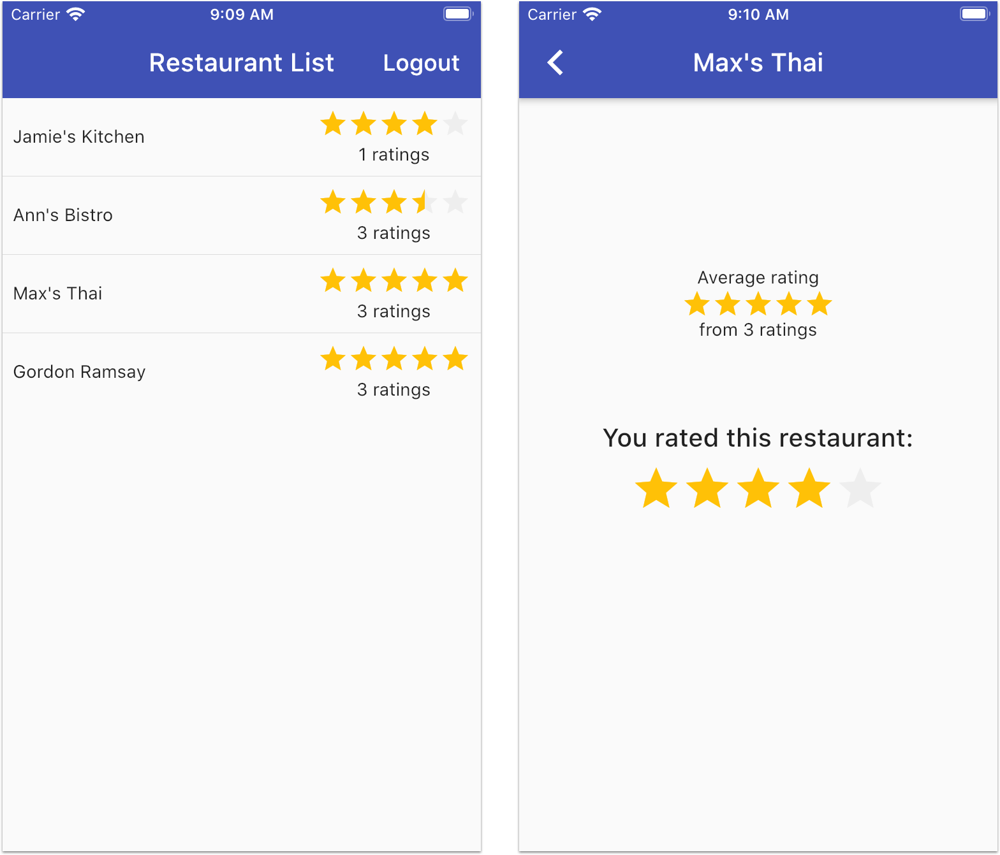

# Restaurant In-App Rating Demo App with Flutter & Firebase

## Features

- Sign in with email & password / anonymous
- Restaurants List
- Restaurant detail page with rating UI
- Cloud Function to calculate average rating and number of ratings
  
## Running the project with Firebase

To use this project with Firebase, some configuration steps are required.

- Create a new project with the Firebase console.
- Add iOS and Android apps in the Firebase project settings.
- On Android, use `com.example.restaurant_ratings_flutter_firebase` as the package name.
- then, [download and copy](https://firebase.google.com/docs/flutter/setup#configure_an_android_app) `google-services.json` into `android/app`.
- On iOS, use `com.example.restaurantRatingsFlutterFirebase` as the bundle ID.
- then, [download and copy](https://firebase.google.com/docs/flutter/setup#configure_an_ios_app) `GoogleService-Info.plist` into `iOS/Runner`, and add it to the Runner target in Xcode.

See this document for full instructions:

- [https://firebase.google.com/docs/flutter/setup](https://firebase.google.com/docs/flutter/setup) 

## References

### Videos

- [Learning Cloud Functions for Firebase (video series)](https://firebase.google.com/docs/functions/video-series)
- [How do Cloud Functions work? | Get to Know Cloud Firestore #11](https://youtu.be/rERRuBjxJ80)

### Documentation

- [Cloud Functions for Firebase](https://firebase.google.com/docs/functions)
- [Call functions from your app](https://firebase.google.com/docs/functions/callable) (aka callable functions)
- [Call functions via HTTP requests](https://firebase.google.com/docs/functions/http-events)
- [Cloud Firestore triggers](https://firebase.google.com/docs/functions/firestore-events)
- [Manage functions deployment and runtime options](https://firebase.google.com/docs/functions/manage-functions)
- [Environment configuration](https://firebase.google.com/docs/functions/config-env) (useful to set API keys without hard-coding them)
- [Deploy to multiple environments with Firebase Hosting](https://firebase.googleblog.com/2016/07/deploy-to-multiple-environments-with.html)

### Sample code

- [Cloud Functions for Firebase Sample Library](https://github.com/firebase/functions-samples)

## [LICENSE: MIT](LICENSE.md)